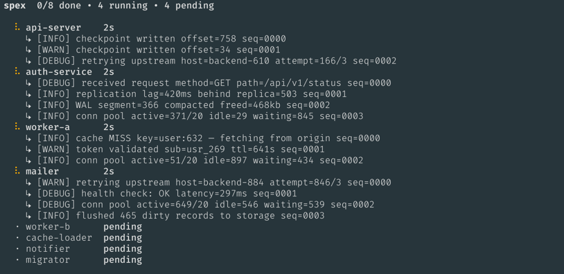
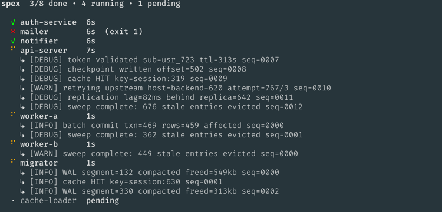

# spex

A generic parallel process runner with a live terminal UI. Runs N shell commands in parallel, shows live output tails per process, and reports structured JSON results.

## Demo

Run the included demo to see spex in action with 8 simulated services (~13 seconds, one intentional failure):

```bash
./demo.sh
```

This runs 8 services with `--max-parallel 4`. One service (`mailer`) exits non-zero on purpose to demonstrate failure handling.

Early in the run, all processes are shown with their live log tails:



As processes complete they are bumped to the top, with failed ones marked in red:



## Installation

**Homebrew (macOS):**

```bash
brew install quantumcycle/tap/spex
```

**Install script (Linux and macOS):**

```bash
curl -fsSL https://raw.githubusercontent.com/quantumcycle/spex/main/install.sh | bash
```

Installs the latest release to `/usr/local/bin/spex`, using `sudo` if needed.

**Build from source:**

```bash
go build -o spex .
```

## Usage

Commands are read from **stdin**, one per line, tab-separated:

```
name<TAB>command
```

```bash
spex [flags] <<EOF
assets      ./.scripts/test-component.sh assets reports/go
publisher   ./.scripts/test-component.sh publisher reports/go
users       ./.scripts/test-component.sh users reports/go
EOF
```

### Flags

| Flag | Default | Description |
|------|---------|-------------|
| `--max-parallel` / `-p` | `4` | Max number of concurrent processes |
| `--tail` / `-n` | `10` | Number of log lines shown per process in the status board |
| `--fail-fast` | `false` | Kill all running processes as soon as one exits non-zero |

## Output

**stderr** — human-readable output (live TUI in interactive mode, streaming lines in CI mode).

**stdout** — JSON summary written once all processes finish.

This separation lets you capture the JSON without interference from status output:

```bash
result=$(spex --max-parallel 4 < runners.txt)
echo "$result" | jq -r '.runners[] | select(.ok) | .name'
```

### JSON schema

```json
{
  "ok": true,
  "duration": "2m14s",
  "runners": [
    {
      "name": "assets",
      "ok": true,
      "exit_code": 0,
      "duration": "45s",
      "output": "last N lines of output, always"
    },
    {
      "name": "publisher",
      "ok": false,
      "exit_code": 1,
      "duration": "12s",
      "output": "full output on non-zero exit, last N lines otherwise"
    }
  ]
}
```

## Interactive mode (TTY)

When running in a terminal, spex renders a live status board on stderr:

```
spex  3/8 done • 2 running • 3 pending

  ✓ assets      45s
  ⠸ publisher   12s
    ↳ running tests for: publisher
    ↳ --- PASS: TestCreatePublisher (0.12s)
    ↳ --- PASS: TestUpdatePublisher (0.08s)
  ⠸ users       8s
    ↳ running tests for: users
    ↳ --- PASS: TestGetUser (0.05s)
  · reviews     pending
  · license     pending
  · media       pending
```

Status icons:

- `·` pending
- `⠸` running (cycling spinner)
- `✓` exited 0
- `✗` exited non-zero

When all processes finish, the board is replaced by a final summary followed by the full output of any failed processes. JSON is then written to stdout.

## CI mode (no TTY / `NO_COLOR`)

When stdout is not a TTY or `NO_COLOR` is set, spex writes plain lines to stderr as events happen:

```
[assets]    starting
[publisher] starting
[users]     starting
[assets]    ✓ done in 45s
[publisher] ✓ done in 38s
[users]     ✗ exited 1 in 12s

--- users output ---
<full buffered output>
---

3 done, 1 error, 2m14s
```

Full output for non-zero exits is printed immediately when that process finishes.

## Signal handling

On `SIGINT` or `SIGTERM`:

1. Forward the signal to all running child processes
2. Wait up to 5 seconds for them to exit
3. Force-kill any that remain
4. Write partial JSON to stdout (unfinished runners marked `"ok": false, "exit_code": null`)
5. Exit with code 130 (SIGINT) or 143 (SIGTERM)
